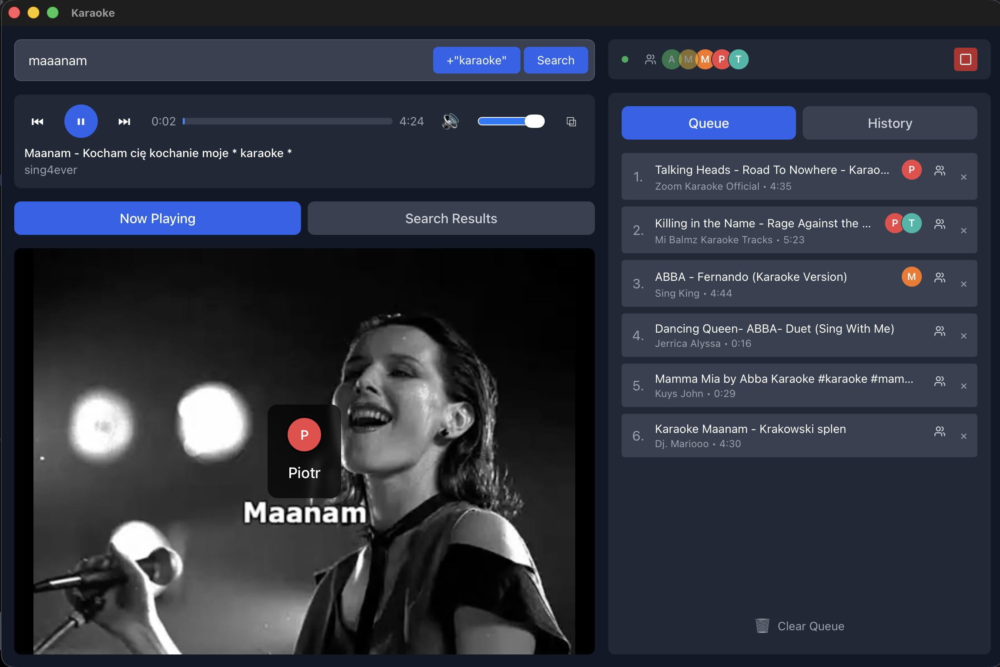

# HomeKaraoke

A cross-platform home karaoke application built with Tauri 2.0 and React.

**Official website:** [https://homekaraoke.app](https://homekaraoke.app)



## Features

### YouTube Integration
- **YouTube Search** - Search karaoke videos using YouTube Data API or yt-dlp
- **Dual Playback Modes** - Stream via yt-dlp (higher quality) or YouTube Embed (no dependencies)
- **Smart Prefetch** - Pre-loads next video URL for seamless transitions

### Local Library
- **Folder Scanning** - Add folders to scan for local video files (MP4, MKV, WebM, etc.)
- **Metadata Fetching** - Fetch song info from MusicBrainz and lyrics from Lrclib
- **CDG Support** - Detects MP3+G karaoke files with CDG companion files

### Queue & Sessions
- **Queue Management** - Build playlists with drag-and-drop reordering
- **Singer Sessions** - Track who's singing with color-coded singer assignments
- **Fair Shuffle** - Automatically rotate through singers fairly
- **Favorites** - Save favorite songs per singer for quick access

### Display & Layout
- **Multi-Display Support** - Detach video window to a secondary display/projector
- **Layout Memory** - Remembers window positions for different display configurations
- **Auto-Restore** - Automatically restores saved layouts when displays reconnect

### Playback Settings
- **Autoplay Next** - Automatically plays next song in queue
- **Default Volume** - Set preferred starting volume
- **Next Song Overlay** - Shows upcoming song info before current song ends

## Installation

Download the latest release from the [Releases page](https://github.com/zalun/karaoke-app/releases/latest):

### macOS
- **Apple Silicon (M1/M2/M3):** `HomeKaraoke_x.x.x_aarch64.dmg`
- **Intel Macs:** `HomeKaraoke_x.x.x_x64.dmg`

### Windows
- **Installer:** `HomeKaraoke_x.x.x_x64-setup.exe`
- **MSI:** `HomeKaraoke_x.x.x_x64_en-US.msi`

### Linux
- **Debian/Ubuntu:** `HomeKaraoke_x.x.x_amd64.deb`
- **Fedora/RHEL:** `HomeKaraoke-x.x.x-1.x86_64.rpm`
- **AppImage:** `HomeKaraoke_x.x.x_amd64.AppImage`

### First Launch Notes

**macOS:** On first launch, right-click the app and select "Open" (required for apps from identified developers).

**Windows:** You may see a SmartScreen warning. Click "More info" then "Run anyway".

## Optional Dependencies

- **yt-dlp** - Required for high-quality streaming and yt-dlp search method
- **ffmpeg** - Required for local video metadata extraction

The app works without these dependencies using YouTube Embed playback.

## Technology Stack

- **Frontend:** React 18 + TypeScript + Vite + Tailwind CSS + Zustand
- **Backend:** Rust (Tauri 2.0)
- **Database:** SQLite (with versioned migrations)
- **Video:** yt-dlp / YouTube Embed
- **Testing:** Vitest (unit) + Playwright (E2E)

## Development

See [CLAUDE.md](CLAUDE.md) for detailed development instructions.

```bash
# Install dependencies
npm install

# Run in development mode
just dev          # or: npm run tauri dev

# Run tests
just test         # Unit tests
just e2e          # E2E tests

# Build for production
just build        # or: npm run tauri build
```

### Project Structure

```
src/                    # React frontend
├── components/         # UI components
├── stores/            # Zustand state management
└── services/          # API and service layers

src-tauri/             # Rust backend
├── src/
│   ├── db/           # SQLite database
│   └── services/     # Backend services
└── tauri.conf.json   # Tauri configuration

tests/e2e/            # Playwright E2E tests
plan/                 # Development planning docs
```

## Current Development Status

**Version:** 0.7.3

| Phase | Status |
|-------|--------|
| Foundation (Tauri + React) | Complete |
| YouTube Integration | Complete |
| Sessions & Singers | Complete |
| Multi-Display Support | Complete |
| Local Library | Complete |
| Downloads | Planned |
| Polish & Settings | In Progress |

See [CHANGELOG.md](CHANGELOG.md) for release history.

## Disclaimer

This software is provided for **personal, non-commercial use only**.

Users are solely responsible for:
- Complying with applicable copyright laws in their jurisdiction
- Respecting platform terms of service (including YouTube's Terms of Service)
- Ensuring they have the right to download or stream any content

The developers of this application do not condone or encourage copyright infringement. This tool is intended for use with:
- Content you own or have created
- Public domain content
- Content licensed under Creative Commons or similar licenses
- Content where you have explicit permission from the copyright holder

**By using this software, you agree to take full responsibility for how you use it.**

## License

MIT License - see [LICENSE](LICENSE) for details.

## Contributing

Contributions are welcome! Please read [CONTRIBUTING.md](CONTRIBUTING.md) before submitting a pull request.
