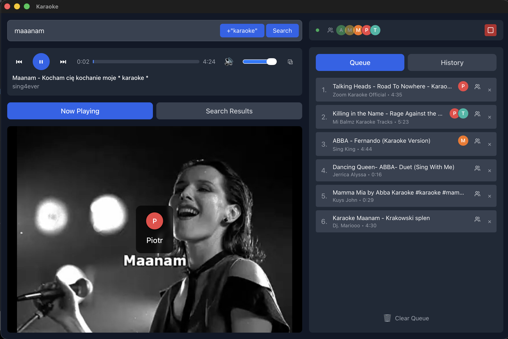

# HomeKaraoke

A cross-platform home karaoke application built with Tauri 2.0 and React.

**Official website:** [https://homekaraoke.app](https://homekaraoke.app)



## Features

### YouTube Integration
- **YouTube Search** - Search karaoke videos using YouTube Data API or yt-dlp
- **Dual Playback Modes** - Stream via yt-dlp (higher quality) or YouTube Embed (no dependencies)
- **Smart Prefetch** - Pre-loads next video URL for seamless transitions

### Local Library
- **Folder Scanning** - Add folders to scan for local video files (`.mp4`, `.mkv`, `.webm`, `.avi`, `.mov`)
- **Metadata Fetching** - Fetch song info from MusicBrainz and lyrics from Lrclib
- **CDG Detection** - Flags MP3+G karaoke videos that have a companion `.cdg` file, so you can filter for them

Local files play through the system WebView, so stick to MP4 (H.264/AAC) or WebM. The scanner indexes MKV and AVI and you can search them, but no WebView on macOS or Windows decodes those containers.

The app saves fetched lyrics next to the video and shows a "has lyrics" badge in the library. Nothing displays them during playback yet. The app detects MP3+G videos but does not play MP3+G audio.

### Queue & Sessions
- **Queue Management** - Build playlists with drag-and-drop reordering
- **Singer Sessions** - Track who's singing with color-coded singer assignments
- **Fair Queue** - Insert new songs at a fair position instead of the end (off by default)
- **Fair Shuffle** - Automatically rotate through singers fairly
- **Favorites** - Save favorite songs per singer for quick access

### Accounts & Hosted Sessions
- **Sign In** - Google, Apple, or Email via Supabase OAuth in your default browser
- **Secure Tokens** - Kept in the system credential store on macOS (Keychain) and Windows (Credential Manager). No Linux store is compiled in yet, so expect sign-in to drop on restart there ([#240](https://github.com/zalun/karaoke-app/issues/240))
- **Host a Session** - Share a join code (`HK-XXXX-XXXX`) and QR code so guests can request songs from their phones without installing anything
- **Song Requests** - Guests request YouTube songs. The app accepts them straight into the queue by default, or you can review each one
- **Live Stats** - Connected guests and pending requests, refreshed every 30 seconds

Hosting requires signing in. Everything else works offline.

### Display & Layout
- **Multi-Display Support** - Detach the video window to a secondary display/projector, with always-on-top and fullscreen
- **Layout Memory** *(macOS)* - Remembers window positions for different display configurations
- **Auto-Restore** *(macOS)* - Automatically restores saved layouts when displays reconnect

Detaching the video window works on all three platforms. Display detection runs only on macOS, so layout memory and auto-restore do too. On Windows and Linux you position the window yourself.

### Playback Settings
- **Autoplay Next** - Automatically plays next song in queue
- **Default Volume** - Set preferred starting volume
- **Next Song Overlay** - Shows upcoming song info before current song ends

## Installation

Download the latest release from the [Releases page](https://github.com/zalun/karaoke-app/releases/latest):

### macOS
- **Apple Silicon (M1/M2/M3):** `HomeKaraoke_x.x.x_aarch64.dmg`
- **Intel Macs:** `HomeKaraoke_x.x.x_x64.dmg`

### Windows
- **Installer:** `HomeKaraoke_x.x.x_x64-setup.exe`
- **MSI:** `HomeKaraoke_x.x.x_x64_en-US.msi`

### Linux
- **Debian/Ubuntu:** `HomeKaraoke_x.x.x_amd64.deb`
- **Fedora/RHEL:** `HomeKaraoke-x.x.x-1.x86_64.rpm`
- **AppImage:** `HomeKaraoke_x.x.x_amd64.AppImage`

### First Launch Notes

**macOS:** Every release carries an Apple Developer ID signature and Apple's notarization, so the app opens on a double-click. macOS may still show its usual "downloaded from the internet" prompt once. Choose "Open".

**Windows:** The app carries no code signature, so SmartScreen will warn you. Click "More info" then "Run anyway".

**Linux:** Install the `.deb` or `.rpm` where you can. Your package manager pulls in the dependencies, and both packages use the WebKit already on your system. The AppImage carries its own WebKit, which can clash with the graphics stack on rolling distributions. Make it executable first (`chmod +x HomeKaraoke_x.x.x_amd64.AppImage`), and see [#237](https://github.com/zalun/karaoke-app/issues/237) if it fails to start.

## Optional Dependencies

- **yt-dlp** - Required for high-quality streaming and the yt-dlp search method
- **ffmpeg** - Required for library thumbnails and video duration (uses `ffmpeg` and `ffprobe` during a scan)

The app works without these dependencies using YouTube Embed playback. Neither one decodes video during playback. The system WebView does that.

## Technology Stack

- **Frontend:** React 18 + TypeScript + Vite + Tailwind CSS + Zustand
- **Backend:** Rust (Tauri 2.0)
- **Database:** SQLite (with versioned migrations)
- **Video:** yt-dlp / YouTube Embed
- **Testing:** Vitest (unit) + Playwright (E2E)

## Development

See [CLAUDE.md](CLAUDE.md) for detailed development instructions.

```bash
# Install dependencies
npm install

# Run in development mode
just dev          # or: npm run tauri dev

# Run tests
just test         # Unit tests
just e2e          # E2E tests

# Build for production
just build        # or: npm run tauri build
```

### Project Structure

```
src/                    # React frontend
├── components/         # UI components
├── stores/            # Zustand state management
└── services/          # API and service layers

src-tauri/             # Rust backend
├── src/
│   ├── db/           # SQLite database
│   └── services/     # Backend services
└── tauri.conf.json   # Tauri configuration

tests/e2e/            # Playwright E2E tests
plan/                 # Development planning docs
```

## Current Development Status

**Version:** 0.8.1

| Phase | Status |
|-------|--------|
| Foundation (Tauri + React) | Complete |
| YouTube Integration | Complete |
| Sessions & Singers | Complete |
| Multi-Display Support | Complete (layout memory is macOS-only) |
| Local Library | Complete |
| Authentication | Complete |
| Hosted Sessions | Complete |
| Downloads | Planned |
| Lyrics Display | Planned |
| Polish & Settings | In Progress |

See [CHANGELOG.md](CHANGELOG.md) for release history.

## Disclaimer

This software is provided for **personal, non-commercial use only**.

Users are solely responsible for:
- Complying with applicable copyright laws in their jurisdiction
- Respecting platform terms of service (including YouTube's Terms of Service)
- Ensuring they have the right to download or stream any content

The developers of this application do not condone or encourage copyright infringement. This tool is intended for use with:
- Content you own or have created
- Public domain content
- Content licensed under Creative Commons or similar licenses
- Content where you have explicit permission from the copyright holder

**By using this software, you agree to take full responsibility for how you use it.**

## License

MIT License - see [LICENSE](LICENSE) for details.

## Contributing

Contributions are welcome! Please read [CONTRIBUTING.md](CONTRIBUTING.md) before submitting a pull request.
